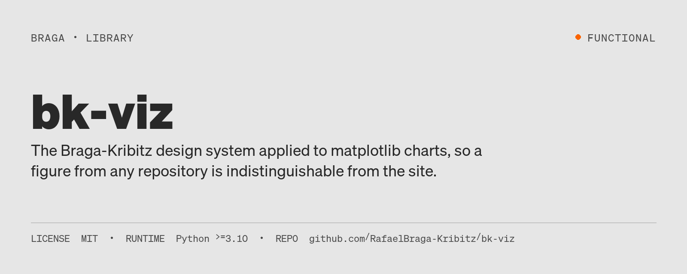
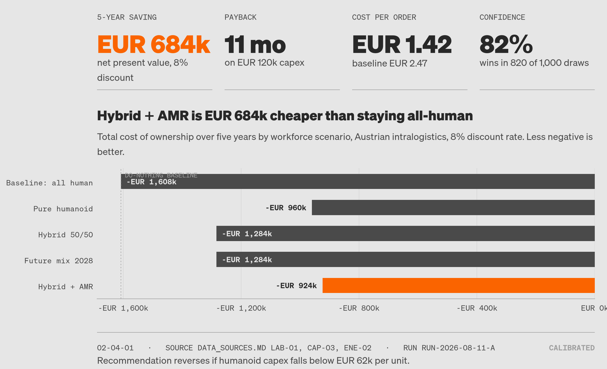

# bk-viz



[](pyproject.toml)
[](LICENSE)
[](#status)

**Status:** Functional

**Problem:** a chart from any repo should be indistinguishable from a chart on
the site; if two charts from different repos do not look like siblings, the
theme is not applied.



*What this image is: the output of `python example_executive_onepager.py` (light mode; `example_dark.png` is the dark render). It shows the theme's decision-panel shape — KPI row, finding title, one highlighted bar, provenance footer. The numbers in it are the script's placeholder DATA block, tagged ILLUSTRATIVE; they are not results from any project. Replace that block with a read from your own metrics artifact.*

## What it does

The Braga-Kribitz Design System, applied to charts. A chart from any repo should
be indistinguishable from a chart on the site.

Every value in `bk_theme.py` is transcribed from the system's own token files
(`tokens/colors.css`, `typography.css`, `spacing.css`, `grid.css`,
`chart-palettes.css`). This module is a mirror, not a second opinion. When a
token changes there, change it here.

## Explore this project

| Path | Start here |
| --- | --- |
| Fast path | [Minimum viable chart](#minimum-viable-chart): one call installs the theme, one call builds the executive panel |
| Deep path | [What it enforces](#what-it-enforces) for the rules, then the [API reference](#api-reference) for every public name |

## Install

```bash
uv pip install "git+https://github.com/RafaelBraga-Kribitz/bk-viz@v1.0.0"
```

```toml
dependencies = ["bk-viz @ git+https://github.com/RafaelBraga-Kribitz/bk-viz@v1.0.0"]
```

The Söhne binaries are **not** bundled. Point the theme at the design system's
`assets/fonts` directory, or set `BK_FONTS`.

## Minimum viable chart

```python
import bk_theme as bk

bk.apply("light", fonts="path/to/design-system/assets/fonts")

fig, ax = bk.decision_panel(
    kpis=[
        {"label": "5-year saving", "value": "EUR 684k",
         "note": "net present value, 8% discount", "accent": True},
        {"label": "Payback", "value": "11 mo", "note": "on EUR 120k capex"},
    ],
    finding="Hybrid + AMR is EUR 684k cheaper than staying all-human",
    context="Five-year TCO by workforce scenario, 8% discount rate.",
    left=0.16,
)
ax.barh(labels, values, color=bk.highlight_palette(labels, highlight="Hybrid + AMR"))
bk.strip_chrome(ax, keep=("bottom",))
bk.money_axis(ax, axis="x", unit="k")
bk.value_labels(ax, orient="h", fmt=bk.fmt_eur_k)
bk.footer(fig, number="02-04-01", source="DATA_SOURCES.md LAB-01",
          run_id="run-2026-08-11-a", tag="CALIBRATED", left=0.16)
bk.save(fig, "reports/executive/01_tco_ranking")
```

`python example_executive_onepager.py` renders the full worked example in both
modes.

## What it enforces

| Rule | Where |
| --- | --- |
| Flat opaque surfaces, no gradient, no shadow, no alpha | `apply()` |
| Page surface is `#E6E6E6`, never white | `apply()`, `save()` |
| Hairlines at 1px `mid` as primary structure | `apply()`, `strip_chrome()` |
| Orange spent on exactly one figure | `highlight_palette()`, `kpi_row()` warn on more |
| Blue is a moment, not a default | only in the `seq-blue` data ramp |
| Numbers set in Söhne Mono, so figures are tabular | rcParams default is mono |
| Square corners, radius 0 | nothing to configure |
| Every published figure carries provenance | `footer()` |

## Modes

`bk.apply("light")` or `bk.apply("dark")`. Dark is a property the figure carries,
matching the system's `.dark` semantics. Chart-ramp dark overrides are applied
automatically by `palette()`.

## Data-vis ramps

All six system scales, by name: `seq-blue`, `seq-orange`, `div-warm-cool`,
`div-political`, `interp-long`, `interp-short`.

```python
bk.palette("div-political", n=5)   # samples evenly across the 13 stops
```

For categorical structure use `bk.neutral_ramp(n)`. A chart is grey structure
plus one orange signal; the system defines no categorical colour ramp on purpose.

## Two things to know about the fonts

**The trial binaries carry 68 glyphs.** They have no `%`, `+`, `€`, `/`, `:`,
parentheses, or the `→` / `↗` arrows the system names as its only iconography.
`bk_theme` builds a family *list* so matplotlib falls back per glyph, and
`check_glyphs()` runs on every `save()` to tell you which characters came from
the fallback face. Browsers do the same fallback silently, which is why the site
looks fine.

**PDF export is refused by default.** PDF embeds the typeface and the bundled
files are evaluation-only. PNG rasterises and SVG written with
`svg.fonttype: none` references by name, so both are safe. Pass `allow_pdf=True`
once retail Söhne is licensed.

## Non-Python surfaces

`bk.dump_tokens("bk_tokens.json")` exports the mirrored token set for a Tableau
custom palette, a Power BI theme file, or a CSS build.

## API reference

Everything in `bk_theme.__all__`. Purposes are the first line of each docstring;
where a function has no docstring, the row states what its code does.

| Name | Purpose |
| --- | --- |
| `TOKENS` | The mirrored token set as a dict; `dump_tokens()` writes it as JSON |
| `COLOR` | Semantic colour roles per mode; light is the default, dark is a property an element carries |
| `CHART_PALETTES` | The chart ramps from `tokens/chart-palettes.css`; index 0 is the most saturated / darkest stop |
| `EPISTEMIC_TAGS` | Epistemic tags, carried on every published figure via `footer()` |
| `register_fonts(path=None)` | Register the Söhne binaries and discover their real family names |
| `apply(theme="light", *, scale, grid, fonts)` | Install the design system as matplotlib rcParams |
| `mode()` | Current render mode, `"light"` or `"dark"` |
| `c(role)` | Resolve a semantic colour role in the current mode |
| `font(role="display", weight=400, size=None)` | Return `FontProperties` for a role and weight |
| `figsize(cols=12, rows=6)` | Convert a column span into inches using the real 12-column page maths |
| `new_figure(cols=12, rows=6, *, nrows, ncols, **kwargs)` | `plt.subplots` sized on the 12-column grid |
| `decision_panel(*, kpis, finding, context, cols, rows, left, right, bottom)` | The executive one-pager: metric row, finding, chart, provenance strip |
| `highlight_palette(labels, highlight=None, *, base, accent)` | Structure grey for everything, orange for the one thing that earned it |
| `neutral_ramp(n)` | `n` structure greys, darkest first; wraps if `n` exceeds the roles |
| `palette(name, n=None, *, reverse=False)` | Return a design-system chart ramp, mode-corrected |
| `tag_color(tag)` | Colour for an epistemic tag |
| `finding_title(ax, finding, context=None)` | Headline states the conclusion; the line under it states the variable |
| `footer(fig, *, source, run_id, tag, note, number, left, right, y)` | Provenance strip: hairline rule, source and run, epistemic tag, note |
| `direct_label(ax, x, y, text, *, color, dx, dy, role, weight, size, ha, va)` | Label a series at its endpoint instead of adding a legend entry |
| `value_labels(ax, *, orient="v", fmt, inside_threshold, pad)` | Write each bar's value at its end, in mono so the figures stay tabular |
| `kpi_row(fig, kpis, *, top, height, left, right)` | A MetricGrid in figure space: hairline rules, mono label, big figure |
| `strip_chrome(ax, keep=("left", "bottom"), *, ticks=True)` | Keep only the hairlines that carry structure; drop tick marks |
| `reference_line(ax, value, label=None, *, orient="h", color)` | A baseline or threshold, drawn as a hairline and labelled in place |
| `annotate_delta(ax, x, y_from, y_to, text, *, color)` | Bracket the gap between two values and name it; the delta is the decision |
| `check_glyphs(fig, *, raise_on_missing=False)` | Report characters in the figure the installed Söhne files cannot render |
| `fmt_eur(v)` | No docstring; formats `v` as `EUR 1,234` with the sign in front |
| `fmt_eur_k(v)` | No docstring; formats `v / 1_000` as `EUR 684k` with the sign in front |
| `fmt_eur_m(v, decimals=2)` | No docstring; formats `v / 1_000_000` as `EUR 1.23M` with the sign in front |
| `fmt_pct(v, decimals=1)` | `v` as a fraction: 0.0615 renders as 6.2% |
| `fmt_pp(v, decimals=2)` | Percentage points, always signed |
| `fmt_months(v)` | No docstring; `"11 mo"` for `v >= 1`, otherwise `v * 30` as days |
| `fmt_int(v)` | No docstring; `v` with thousands separators and no decimals |
| `money_axis(ax, axis="y", unit="k", nbins=5)` | Euro formatting on an axis; `nbins` caps ticks, five is usually enough |
| `pct_axis(ax, axis="y", decimals=0, nbins=5)` | No docstring; sets `fmt_pct` as the axis formatter and caps ticks at `nbins` |
| `save(fig, path, *, formats=("png", "svg"), dpi, close, allow_pdf=False)` | Write the figure once per format; `path` is given without an extension |
| `dump_tokens(path="bk_tokens.json")` | Export the mirrored token set as JSON |
| `plotly_template(register_as="bk", set_default=True)` | Build and register the equivalent plotly template; requires plotly |

## Acceptance test

If two charts from different repos do not look like siblings, the theme is not
applied.

## Limitations

- **The trial binaries carry 68 glyphs.** They have no `%`, `+`, `€`, `/`, `:`,
  parentheses, or the `→` / `↗` arrows the system names as its only iconography;
  `check_glyphs()` runs on every `save()` to tell you which characters came from
  the fallback face.
- **PDF export is refused by default.** PDF embeds the typeface and the bundled
  files are evaluation-only. Pass `allow_pdf=True` once retail Söhne is licensed.
- **The token files are mirrored by hand.** Every value in `bk_theme.py` is
  transcribed from the system's own token files; this module is a mirror, not a
  second opinion. When a token changes there, change it here.
- **The Söhne binaries are not bundled.** Point the theme at the design system's
  `assets/fonts` directory, or set `BK_FONTS`.
- **No categorical colour ramp.** The system defines none on purpose; a chart is
  grey structure (`neutral_ramp(n)`) plus one orange signal.

## Stack

| Technology | Why it is here |
| --- | --- |
| Python 3.10+ | `requires-python = ">=3.10"` in `pyproject.toml` |
| matplotlib >= 3.7 | The theme is installed as matplotlib rcParams by `apply()` |
| fonttools >= 4.40 | `check_glyphs()` reads the installed font files' character map to name the missing glyphs |
| plotly >= 5.18 (optional, `[plotly]` extra) | `plotly_template()` builds and registers the equivalent plotly template |

## Repository structure

| Path | Role |
| --- | --- |
| `bk_theme.py` | The module: Braga-Kribitz Design System, applied to charts, transcribed from the system's token files. The only file packaged in the wheel |
| `bk_tokens.json` | The mirrored token set as JSON, the output of `dump_tokens()`, for a Tableau palette, a Power BI theme file or a CSS build |
| `example_executive_onepager.py` | Worked example: the executive decision panel, rendered in both light and dark |
| `example_light.png` | The worked example in light mode (the hero image above) |
| `example_dark.png` | The worked example in dark mode |
| `pyproject.toml` | Package metadata, dependencies and the hatchling build (the wheel includes only `bk_theme.py`) |
| `README.md` | This file |
| `LICENSE` | MIT |

## Status

**Status:** Functional

Repository last updated 2026-08-08 (date of the last commit).

## License

MIT. See [`LICENSE`](LICENSE).

## Author

<table>
  <tr>
    <td width="110">
      
    </td>
    <td>
      <strong>Rafael Braga-Kribitz</strong><br />
      Seiersberg-Pirka, Austria · Portfolio project, 2026<br />
      <a href="https://www.linkedin.com/in/rafaelbragakribitz/">LinkedIn</a>
      ·
      <a href="mailto:rafaelbragakribitz@gmail.com">rafaelbragakribitz@gmail.com</a>
    </td>
  </tr>
</table>
